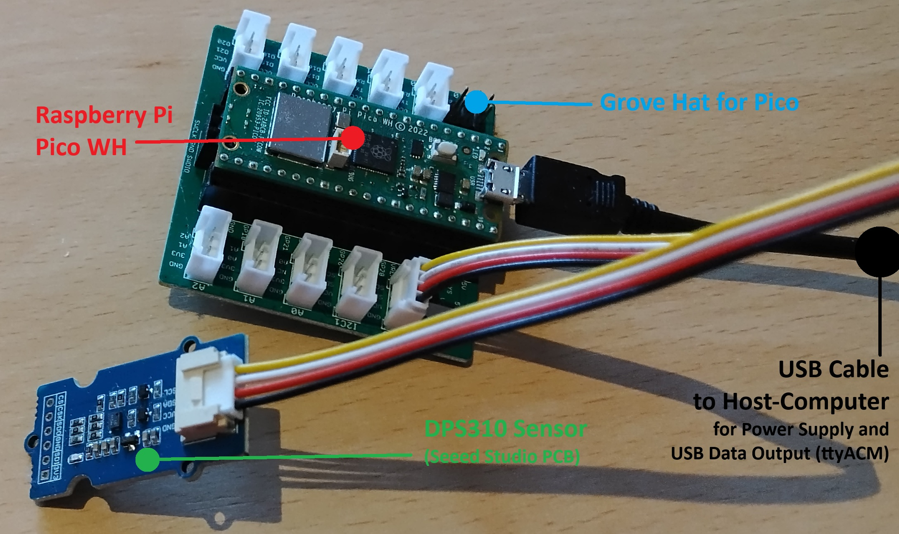

# pico-baro-usb
Reading Pressure Sensor DPS310 from Raspberry Pi Pico (C Language)

## Keywords
Barometric Sensor, Temperature Sensor, DPS310  
Raspberry Pi Pico RP2040

## Hardware
Whilst you could physically connect the Pico and the Baro-/Temp-Sensor in quite many ways, there is a "solder free" option by using (buying) this hardware from [Seeed Studio](https://www.seeedstudio.com) or one of their many distributors (e.g. [BerryBase](https://www.berrybase.de/en/seeed-grove-high-precision-barometric-pressure-sensor-dps310) in Germany/Europe):
 - Sensor: [DPS310 Ready-to-use-PCB](https://wiki.seeedstudio.com/Grove-High-Precision-Barometric-Pressure-Sensor-DPS310)
 - Adaptor/Connector from Pico (with Header Pins, e.g. WH-Type) to Sensor: ["Grove Hat" for Pi Pico](https://wiki.seeedstudio.com/Grove-Starter-Kit-for-Raspberry-Pi-Pico)

The picture below presents an Overview on such Hardware Setup:



## Preconditions for Building
You should have the "**Raspberry Pi Pico SDK**" installed on your computer. Installation and "First Steps" are well described in the official Documentation:  
[Getting Started with Pico](https://datasheets.raspberrypi.com/pico/getting-started-with-pico.pdf)  
The instructions below are assuming cross-compilation/build on a "Linux" computer (i.e. a "Linux Host"), but instructions for Windows are as well contained in that document above.

## Download Instructions
Usually, during SDK Installation you'll have created a folder named `pico`. Therein, you can now download the source code using [git](https://en.wikipedia.org/wiki/Git):  
`git clone https://github.com/dieselman-de/pico-baro-usb.git`  

This method will automatically create a new sub-folder `pico-baro-usb` and download all the files from repository  (i.e. including License-File and this README)

Alternatively (e.g. if you don't want to use `git clone`) you can create a folder on your own and download at least these two files:
 - **baro-usb.c**
 - **CMakeLists.txt**

## Preparing for Build
As described in chapter 8 of "[Getting Started with Pico](https://datasheets.raspberrypi.com/pico/getting-started-with-pico.pdf)", you'll have to copy the `pico_sdk_import.cmake` file into the very same project-folder, where the two files above reside. If you installed the SDK and this project's code in the usual way, this can be accomplished like this:  
`cp ../pico-sdk/external/pico_sdk_import.cmake .`

## Creating Makefile with cmake
As likely well known from a number of similar projects, create a `build` sub-folder, dive into it an run `cmake` once similar to this example:  
`mkdir build`  
`cd build`  
**`cmake -DPICO_SDK_PATH=../../pico-sdk -DPICO_BOARD=pico_w ..`**

Some words on the parameters used here for cmake:
 - the parameter `PICO_SDK_PATH`is simply pointing to that folder, in which you've installed your "Raspberry Pi Pico SDK"
 - the parameter `PICO_BOARD` needs to match your Pico-Hardware. The example `pico_w` above is targeting an RP2040 with "WiFi" on Hardware (albeit WiFi is not necessary for this project)

And don't forget the closing two `..` dots in order to tell cmake, that the `CMakeLists.txt`-file can be found in folder above :smirk:

Of course, instead of handing the parameters to cmake with `-D` you can as well use "Environment Variables" (e.g. `export PICO_SDK_PATH=/home/myhome/pico/pico-sdk`)

## Building
Within the `build`subfolder of this project run  
`make`

## Expectable Output
After uploading the .uf2-File to the Pico, it will reboot and expose a serial interface via USB.

For instance, on my Linux-Host I'm able to read the output using `minicom`:  
`minicom -D /dev/ttyACM0`  
It is, however, quite likely that on *your* system `ACM0`is already present and you'll see `ACM1`, `ACM2` or even higher numbers ...

On purpose, the printout via USB is designed to be quite talkative ... example output:  
```
*** Starting 'baro-usb' ***

I2C Interface (HW Block) in use: i2c0

I2C PIN Assignment
SDA PIN:      8
SCL PIN:      9

Product ID:   0
Revision ID:  1

Initial State of Registers:
-- Pressure Meas. Config. (PRS_CFG):          0
-- Temperature Meas. Config. (TMP_CFG):       0
-- Measurement Configuration (MEAS_CFG):     c0
-- Configuration Register (CFG_REG):          0
-- Coefficient Source Register (COEF_SRCE):  a4
Temperature Coefficients are based on External Sensor (MEMS Element)

Reconfigured State of Registers:
-- Pressure Meas. Config. (PRS_CFG) new:      3
-- Temperature Meas. Config. (TMP_CFG) new:  82
 0d fe db 13 b4 cf 38 91 f5 96 06 1e dd ac 00 8e fb 57

Coeff c0  / value inside:     223
Coeff c0  / value hex:       00df
Coeff c1  / value inside:    3803
Coeff c1  / value hex:       0edb

Coeff c00 / value inside:   80716
Coeff c00 / value hex:      13b4c
Coeff c10 / value inside:  997521
Coeff c10 / value hex:      f3891
Coeff c20 / value inside:   56748
Coeff c20 / value hex:       ddac
Coeff c30 / value inside:   64343
Coeff c30 / value hex:       fb57
Coeff c01 / value inside:   62870
Coeff c01 / value hex:       f596
Coeff c11 / value inside:    1566
Coeff c11 / value hex:       061e
Coeff c21 / value inside:     142
Coeff c21 / value hex:       008e

Calibration Coefficients:
Coeff c0:        223
Coeff c1:       -293
Coeff c00:     80716
Coeff c10:    -51055
Coeff c20:     -8788
Coeff c30:     -1193
Coeff c01:     -2666
Coeff c11:      1566
Coeff c21:       142

Registers 0x00 to 0x0D:
 00 00 00 00 00 00 03 82 c0 00 00 00 00 10

Registers TMP_DATA:
 11 59 94

Raw Temperature (24bit):   1137044
Temperature raw,scaled (float):  0.309820
Temperature °C compensated (float):  20.722771

Registers PRS_DATA:
 cc 9e a6

Raw Pressure (24bit):  -3367258
Pressure raw,scaled (float):  -0.428169
Pressure (Pa) compensated (float):  100033.070312
Pressure (hPa) ...thus QFE:         1000.33

Registers TMP_DATA:
 11 56 ae

Raw Temperature (24bit):   1136302
Temperature raw,scaled (float):  0.309618
Temperature °C compensated (float):  20.782005

Registers PRS_DATA:
 cc 9e 12

Raw Pressure (24bit):  -3367406
Pressure raw,scaled (float):  -0.428188
Pressure (Pa) compensated (float):  100034.562500
Pressure (hPa) ...thus QFE:         1000.35
```
Feel free to reduce printouts according to your needs ... happy coding 🙂
